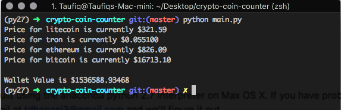

# crypto-coin-counter

This python script will scrape the prices of various cryptocurrencies from coinmarketcap and multiply them with the quantity you own to give you an estimation of how much your crypto-portfolio is worth. 

## Requirements

* [Python 2.7](https://www.python.org/downloads/)
* [urllib](https://docs.python.org/2/library/urllib2.html)
* [BeautifulSoup](https://www.crummy.com/software/BeautifulSoup/bs4/doc/)

Note: this software was built using the anaconda python 2.7 interpreter on Max OS X. If you have problems on your env, shoot me a quick email at tdhanani3@gmail.com and we'll figure it out. 


## Running the Program 

__Step 1__ is to enter the amounts of each crpyto currency you own in the `hodl.json` file. You can enter any amount from zero to zuckerberg. Feel free to add other currencies or remove the ones that are provided as an example. The program will most likely crash if you don't use the actual name that coinmarketcap uses. The actual name can be found in the url for that cryptocurency. [example](https://coinmarketcap.com/currencies/ethereum/)

__Step 2__ After ensuring that you have all the dependencies (including python), fire up your terminal and run ```python main.py``` to run the program. Currently there are no arguments or options that can be passed in. Probably will add some if I stop being so lazy. Also, by default the program will log your portfolio value in a file called `wallet_log.txt`.




## Functionality 

The program works well enough for my use case. Hmu if you find a bug or want to add some cool functionality. Since I'm webscraping and not using an api, this all can break if coinmarketcap changes their webpage or if they throttle people that make multiple requests not from browsers. Hopefully, they don't start anytime soon!